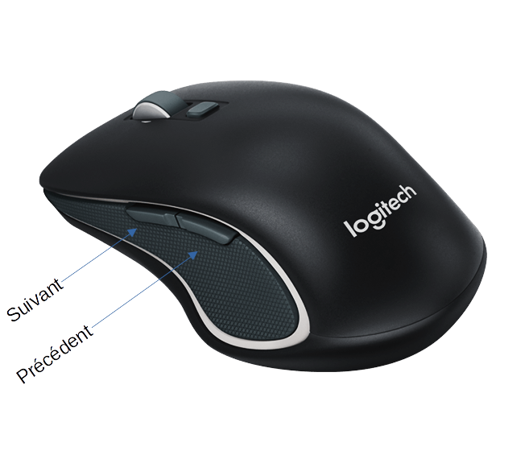

# Support des boutons suivant-précédent sur la souris Logitech M560

Petite configuration pour l'utilitaire **xbindkeys**. Cette configuration permet de faire fonctionner les boutons **suivant** et **précédent** sur Linux.

| **Nom du fichier**                 | **Description**                                              |
| ---------------------------------- | ------------------------------------------------------------ |
|                                    | Script xdg-autostart qui se lance au démarrage de la session graphique. |
| logitech-m560-buttons-support.conf | Fichier de configuration pour l'utilitaire **xbindkeys**.    |
| PKGBUILD                           | Script PKGBUILD pour la création de paquet pour Archlinux / Manjaro. |

